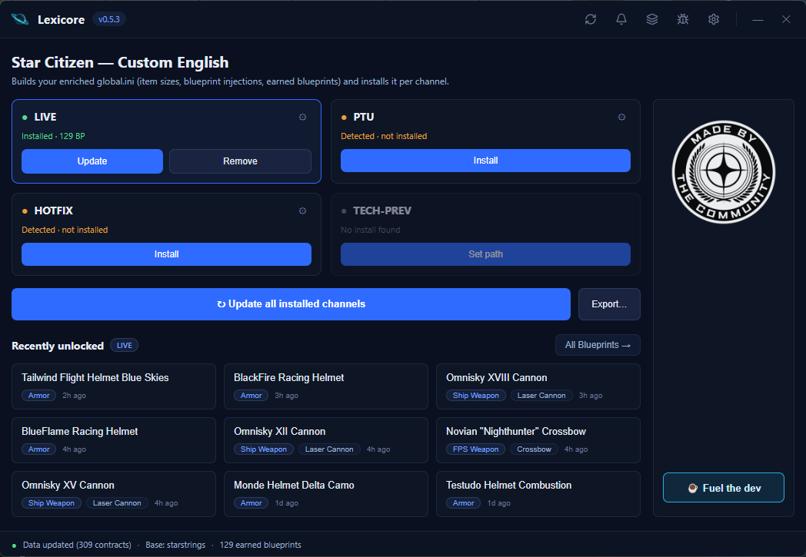
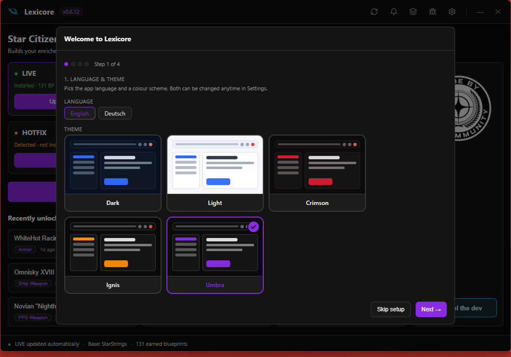
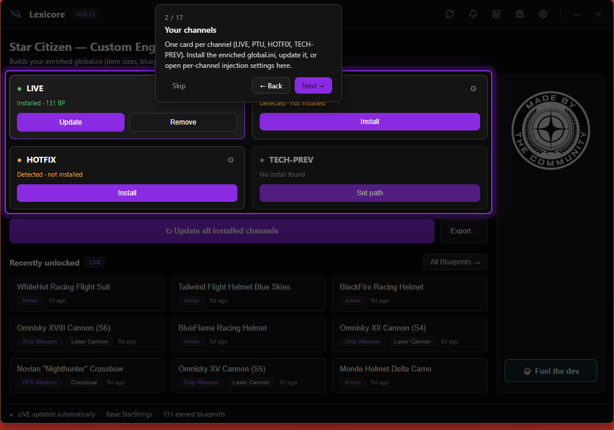
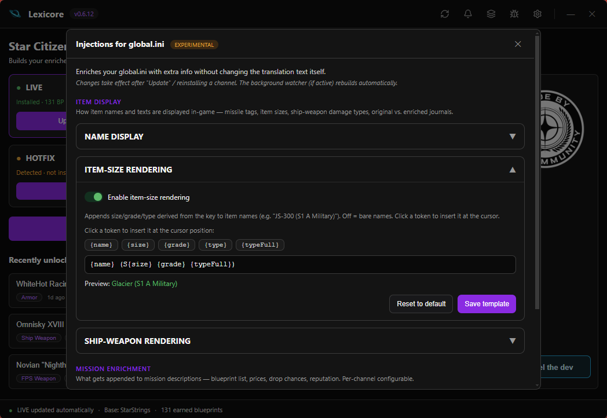
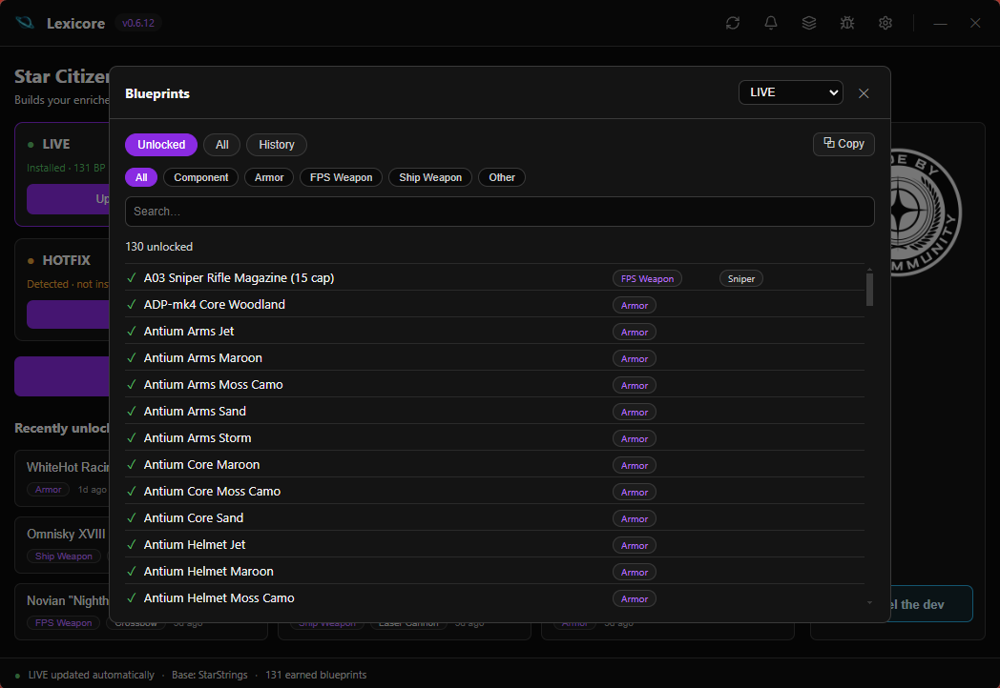
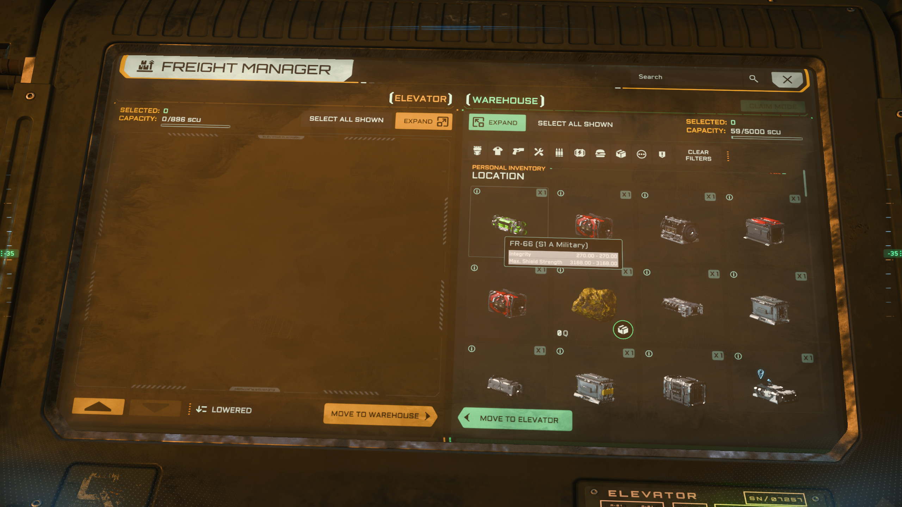
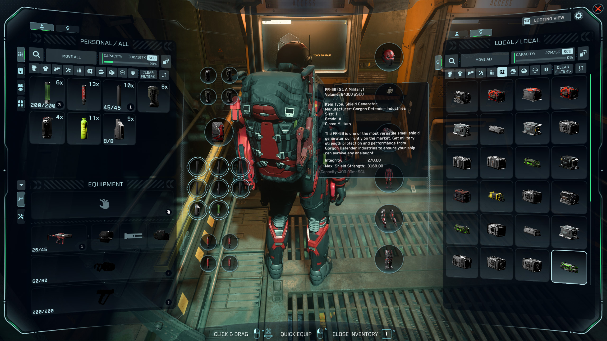
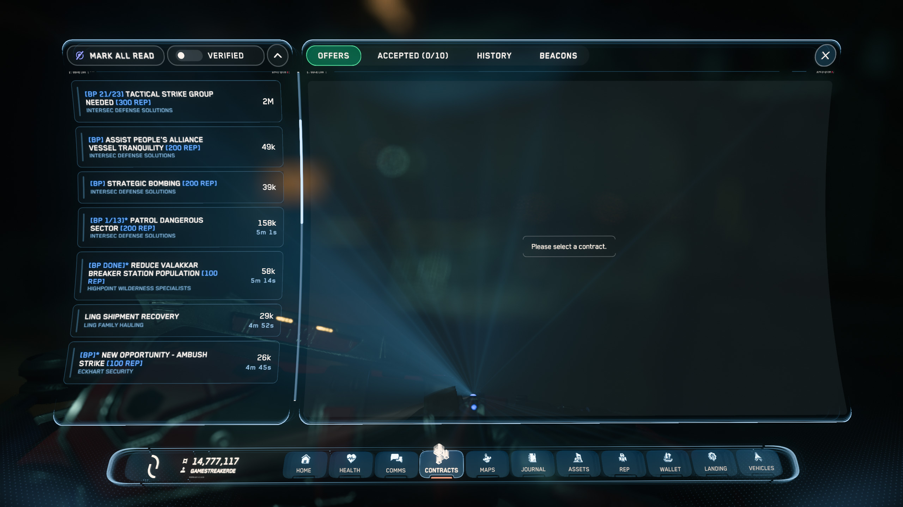
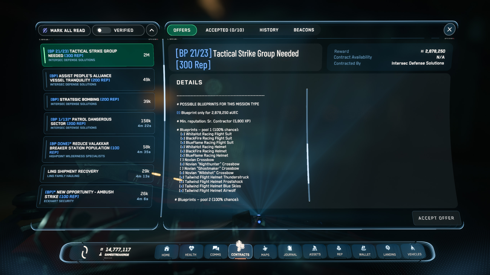

<picture>
  <source media="(prefers-color-scheme: dark)" srcset="assets/header-dark.png">
  
</picture>

---

**Unofficial Star Citizen helper: blueprint info & readable item sizes**
 
**Inoffizieller Star-Citizen-Helfer: Blueprint-Infos & lesbare Item-Größen**

<!-- VT_BADGE -->

SHA-256: <code>2dce54c642a25f0ffd3e77b54b322c1e142f164ff1c0fe2674e575d7eef47225</code>
<!-- /VT_BADGE -->

### ➜ [Download the latest version](https://github.com/GameStreakerDE/Lexicore/releases/latest)

**[English](#english) · [Deutsch](#deutsch)**

The Lexicore app — manage every channel, see recently unlocked blueprints. · Die Lexicore-App — alle Kanäle verwalten, zuletzt freigeschaltete Baupläne sehen.

 

Guided 4-step setup + interactive tour through every button — so nobody gets lost. · Geführtes 4-Schritte-Setup + interaktive Tour durch jede Schaltfläche — damit niemand verloren ist.

 

Configure injections (item display, mission enrichment, markers) and browse every blueprint by category, search and ownership state. · Injektionen konfigurieren (Item-Anzeige, Missions-Anreicherung, Markierungen) und alle Baupläne nach Kategorie, Suche und Besitzstand durchsehen.

 

In-game item names carry size, grade &amp; type (FR-66 → "FR-66 (S1 A Military)") — in tooltips, the freight manager and inventory detail panels. · Item-Namen tragen Größe, Grade &amp; Typ (FR-66 → „FR-66 (S1 A Military)") — in Tooltips, im Freight Manager und in Inventar-Detail-Panels.

 

Contract list shows [BP] / [BP K/N] / [BP DONE] markers at a glance, mission details get the full blueprint pool with [x]/[ ] ownership. · Die Contracts-Liste zeigt auf einen Blick [BP] / [BP K/N] / [BP DONE] Marker, Mission-Details bekommen den kompletten Blueprint-Pool mit [x]/[ ] Besitzstand.

## English

Lexicore builds a customized **English** `global.ini` for Star Citizen and enriches
missions with useful info — all through a simple interface, with no manual file
juggling.

### What Lexicore does

- **Readable item sizes** instead of cryptic codes (`JS-300 (S1 A Military)` instead of `JS-300`).
- **Ship weapons** get their damage type and class in the name (`Ballistic Cannon`, `Laser Repeater`, `Distortion Scattergun`, …).
- **Blueprint info** right inside the mission: price, reputation, drop chance and the full list of possible blueprints.
- **Unlocked blueprints** are marked automatically — Lexicore reads along with your `Game.log` and adds `[BP]` / `[BP K/N]` / `[BP DONE]` markers to mission titles.
- **Background watcher:** newly unlocked blueprints land in the `global.ini` automatically; they're in the game on your next launch.
- **All channels:** LIVE, PTU, HOTFIX and TECH-PREV managed separately, each with its own injection settings.
- **Guided setup & interactive tour:** 4-step wizard for first-time configuration plus a coachmark tour through every button — replayable anytime.
- **5 themes:** UEE Dark, Light, Crimson, Ignis, Umbra — picked with a live preview card.
- **Built-in feedback:** one-click bug report or feature request, with system info and the matching GitHub issue template pre-filled.
- **Auto-update:** Lexicore updates itself and stays in the tray during updates if it was already tray-resident.

### Installation

1. [Download the latest version](https://github.com/GameStreakerDE/Lexicore/releases/latest) (`Lexicore Setup x.y.z.exe`).
2. Run the installer. Since the app isn't signed (yet), Windows may show a SmartScreen prompt → "More info" → "Run anyway".
3. On first launch a short setup wizard walks you through paths and options.

### Disclaimer

Lexicore is an **unofficial, fan-made** tool and is in no way affiliated with
Cloud Imperium Games (CIG) or Roberts Space Industries (RSI). "Star Citizen" and
related trademarks are the property of their respective owners. Use is at your own risk.

Base localization: [StarStrings](https://github.com/MrKraken/StarStrings) (MrKraken) ·
Data: [scmdb.net](https://scmdb.net)

### Support

Lexicore is a free community project. If it helps you, I'd be happy about a coffee:

➜ [**ko-fi.com/gamestreakerde**](https://ko-fi.com/gamestreakerde/tip)

### License

Proprietary software — all rights reserved. Use governed by the [EULA](EULA.md)
(see also [LICENSE](LICENSE)).

© 2026 GameStreakerDE (Daniel Meyer)

---

## Deutsch

Lexicore baut eine angepasste **englische** `global.ini` für Star Citizen und reichert
Missionen mit nützlichen Infos an — komplett über eine einfache Oberfläche, ohne
manuelles Dateigeschiebe.

### Was Lexicore kann

- **Lesbare Item-Größen** statt kryptischer Kürzel (`JS-300 (S1 A Military)` statt `JS-300`).
- **Schiffswaffen** bekommen Schadenstyp und Klasse in den Namen (`Ballistic Cannon`, `Laser Repeater`, `Distortion Scattergun`, …).
- **Blueprint-Infos** direkt in der Mission: Preis, Reputation, Drop-Chance und die komplette Liste möglicher Baupläne.
- **Freigespielte Baupläne** werden automatisch markiert — Lexicore liest dein `Game.log` mit und ergänzt `[BP]` / `[BP K/N]` / `[BP DONE]` Marker in den Missions-Titeln.
- **Hintergrund-Watcher:** Neu freigeschaltete Blueprints landen automatisch in der `global.ini`, beim nächsten Spielstart sind sie drin.
- **Alle Kanäle:** LIVE, PTU, HOTFIX und TECH-PREV getrennt verwaltbar, jeder mit eigenen Injektions-Einstellungen.
- **Geführtes Setup & interaktive Tour:** 4-Schritte-Wizard für die Erst-Konfiguration plus Coachmark-Tour durch jede Schaltfläche — jederzeit wiederholbar.
- **5 Themes:** UEE Dark, Light, Crimson, Ignis, Umbra — mit Live-Vorschau-Karten ausgewählt.
- **Eingebautes Feedback:** Bug melden oder Feature vorschlagen mit einem Klick, System-Infos und das passende GitHub-Issue-Template werden vorausgefüllt.
- **Auto-Update:** Lexicore aktualisiert sich selbst und bleibt während des Updates im Tray, falls es vorher dort lief.

### Installation

1. [Neueste Version herunterladen](https://github.com/GameStreakerDE/Lexicore/releases/latest) (`Lexicore Setup x.y.z.exe`).
2. Installer ausführen. Da die App (noch) nicht signiert ist, zeigt Windows ggf. einen SmartScreen-Hinweis → „Weitere Informationen" → „Trotzdem ausführen".
3. Beim ersten Start führt dich ein kurzer Einrichtungs-Assistent durch Pfade und Optionen.

### Hinweis

Lexicore ist ein **inoffizielles, von Fans erstelltes** Werkzeug und steht in keiner
Verbindung zu Cloud Imperium Games (CIG) oder Roberts Space Industries (RSI).
„Star Citizen" und zugehörige Marken sind Eigentum ihrer jeweiligen Inhaber.
Die Nutzung erfolgt auf eigenes Risiko.

Basis-Lokalisierung: [StarStrings](https://github.com/MrKraken/StarStrings) (MrKraken) ·
Daten: [scmdb.net](https://scmdb.net)

### Unterstützen

Lexicore ist ein kostenloses Community-Projekt. Wenn es dir hilft, freue ich mich über einen Kaffee:

➜ [**ko-fi.com/gamestreakerde**](https://ko-fi.com/gamestreakerde/tip)

### Lizenz

Proprietäre Software — alle Rechte vorbehalten. Nutzung gemäß [EULA](EULA.md)
(siehe auch [LICENSE](LICENSE)).

© 2026 GameStreakerDE (Daniel Meyer)

<picture>
  <source media="(prefers-color-scheme: dark)" srcset="assets/made-by-community-dark.png">
  
</picture>

---

**Legal notice / Rechtlicher Hinweis**

This is an unofficial Star Citizen fan site, not affiliated with the Cloud Imperium group of companies. All content on this site not authored by its host or users are property of their respective owners. Official site: <https://robertsspaceindustries.com>

Lexicore is a fan localization tool that modifies the local Star Citizen localization file of your own installation; it is free and clearly unofficial. Star Citizen®, Squadron 42®, Roberts Space Industries® and Cloud Imperium® are trademarks of Cloud Imperium Rights LLC and Cloud Imperium Rights Ltd. This project uses assets from the official Star Citizen Fan Kit in accordance with its terms and is not endorsed or sponsored by Cloud Imperium. Use is at your own risk.

Dies ist eine inoffizielle Star-Citizen-Fan-Seite und steht in keiner Verbindung zur Cloud-Imperium-Unternehmensgruppe. Alle Inhalte dieser Seite, die nicht vom Betreiber oder den Nutzern erstellt wurden, sind Eigentum ihrer jeweiligen Inhaber. Offizielle Seite: <https://robertsspaceindustries.com>

Lexicore ist ein Fan-Lokalisierungs-Werkzeug, das die lokale Star-Citizen-Lokalisierungsdatei deiner eigenen Installation verändert; es ist kostenlos und eindeutig inoffiziell. Star Citizen®, Squadron 42®, Roberts Space Industries® und Cloud Imperium® sind Marken von Cloud Imperium Rights LLC und Cloud Imperium Rights Ltd. Dieses Projekt verwendet Assets aus dem offiziellen Star-Citizen-Fan-Kit gemäß dessen Bedingungen und wird von Cloud Imperium weder unterstützt noch gesponsert. Die Nutzung erfolgt auf eigenes Risiko.
