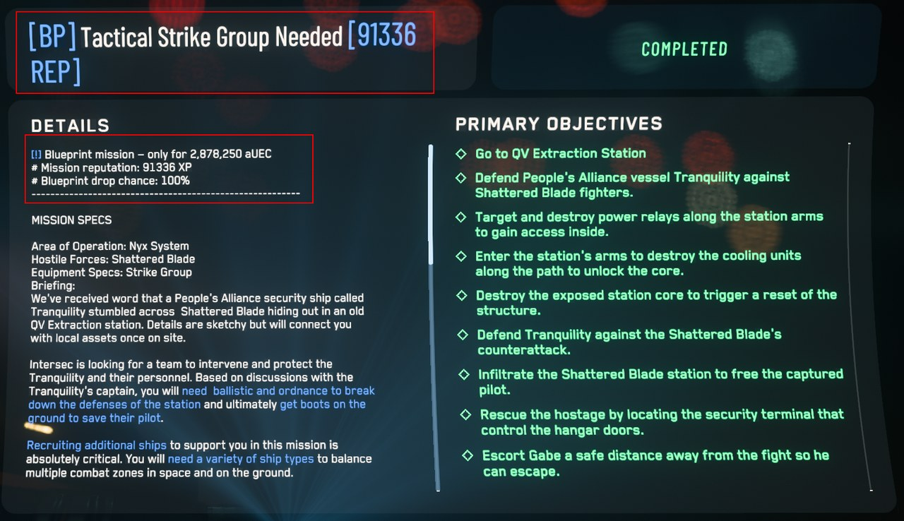
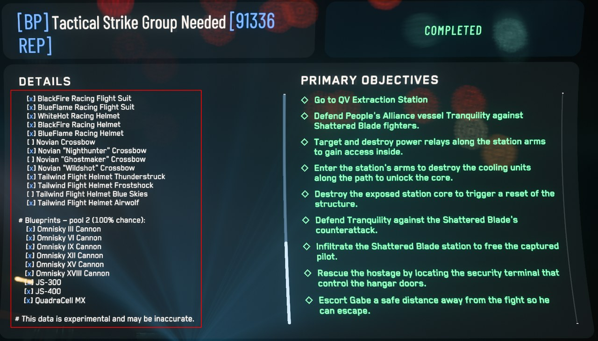

# Lexicore

**Unofficial Star Citizen helper: blueprint info & readable item sizes**
**Inoffizieller Star-Citizen-Helfer: Blueprint-Infos & lesbare Item-Größen**

### ➜ [Download the latest version](https://github.com/GameStreakerDE/StarCitizen_Lexicore_Releases/releases/latest)

**[English](#english) · [Deutsch](#deutsch)**

The Lexicore app — manage every channel, see recently unlocked blueprints. · Die Lexicore-App — alle Kanäle verwalten, zuletzt freigeschaltete Baupläne sehen.

 

In-game: blueprint missions show price, reputation &amp; drop chance — plus which blueprints you already own. · Im Spiel: Bauplan-Missionen zeigen Preis, Reputation &amp; Drop-Chance — und welche Baupläne du schon besitzt.

## English

Lexicore builds a customized **English** `global.ini` for Star Citizen and enriches
missions with useful info — all through a simple interface, with no manual file
juggling.

### What Lexicore does

- **Readable item sizes** instead of cryptic codes.
- **Blueprint info** right inside the mission: price, reputation, drop chance and possible blueprints.
- **Unlocked blueprints** are marked automatically — Lexicore reads along with your `Game.log`.
- **Background watcher:** newly unlocked blueprints land in the `global.ini` automatically; they're in the game on your next launch.
- **All channels:** LIVE, PTU, HOTFIX and TECH-PREV managed separately.
- **Auto-update:** Lexicore updates itself.

### Installation

1. [Download the latest version](https://github.com/GameStreakerDE/StarCitizen_Lexicore_Releases/releases/latest) (`Lexicore Setup x.y.z.exe`).
2. Run the installer. Since the app isn't signed (yet), Windows may show a SmartScreen prompt → "More info" → "Run anyway".
3. On first launch a short setup wizard walks you through paths and options.

### Disclaimer

Lexicore is an **unofficial, fan-made** tool and is in no way affiliated with
Cloud Imperium Games (CIG) or Roberts Space Industries (RSI). "Star Citizen" and
related trademarks are the property of their respective owners. Use is at your own risk.

Base localization: [StarStrings](https://github.com/MrKraken/StarStrings) (MrKraken) ·
Data: [scmdb.net](https://scmdb.net)

### Support

Lexicore is a free community project. If it helps you, I'd be happy about a coffee:

➜ [**ko-fi.com/gamestreakerde**](https://ko-fi.com/gamestreakerde/tip)

### License

Proprietary software — all rights reserved. Use governed by the [EULA](EULA.md)
(see also [LICENSE](LICENSE)).

© 2026 GameStreakerDE (Daniel Meyer)

---

## Deutsch

Lexicore baut eine angepasste **englische** `global.ini` für Star Citizen und reichert
Missionen mit nützlichen Infos an — komplett über eine einfache Oberfläche, ohne
manuelles Dateigeschiebe.

### Was Lexicore kann

- **Lesbare Item-Größen** statt kryptischer Kürzel.
- **Blueprint-Infos** direkt in der Mission: Preis, Reputation, Drop-Chance und mögliche Baupläne.
- **Freigespielte Baupläne** werden automatisch markiert — Lexicore liest dein `Game.log` mit.
- **Hintergrund-Watcher:** Neu freigeschaltete Blueprints landen automatisch in der `global.ini`, beim nächsten Spielstart sind sie drin.
- **Alle Kanäle:** LIVE, PTU, HOTFIX und TECH-PREV getrennt verwaltbar.
- **Auto-Update:** Lexicore aktualisiert sich selbst.

### Installation

1. [Neueste Version herunterladen](https://github.com/GameStreakerDE/StarCitizen_Lexicore_Releases/releases/latest) (`Lexicore Setup x.y.z.exe`).
2. Installer ausführen. Da die App (noch) nicht signiert ist, zeigt Windows ggf. einen SmartScreen-Hinweis → „Weitere Informationen" → „Trotzdem ausführen".
3. Beim ersten Start führt dich ein kurzer Einrichtungs-Assistent durch Pfade und Optionen.

### Hinweis

Lexicore ist ein **inoffizielles, von Fans erstelltes** Werkzeug und steht in keiner
Verbindung zu Cloud Imperium Games (CIG) oder Roberts Space Industries (RSI).
„Star Citizen" und zugehörige Marken sind Eigentum ihrer jeweiligen Inhaber.
Die Nutzung erfolgt auf eigenes Risiko.

Basis-Lokalisierung: [StarStrings](https://github.com/MrKraken/StarStrings) (MrKraken) ·
Daten: [scmdb.net](https://scmdb.net)

### Unterstützen

Lexicore ist ein kostenloses Community-Projekt. Wenn es dir hilft, freue ich mich über einen Kaffee:

➜ [**ko-fi.com/gamestreakerde**](https://ko-fi.com/gamestreakerde/tip)

### Lizenz

Proprietäre Software — alle Rechte vorbehalten. Nutzung gemäß [EULA](EULA.md)
(siehe auch [LICENSE](LICENSE)).

© 2026 GameStreakerDE (Daniel Meyer)

<picture>
  <source media="(prefers-color-scheme: dark)" srcset="assets/made-by-community-dark.png">
  
</picture>

